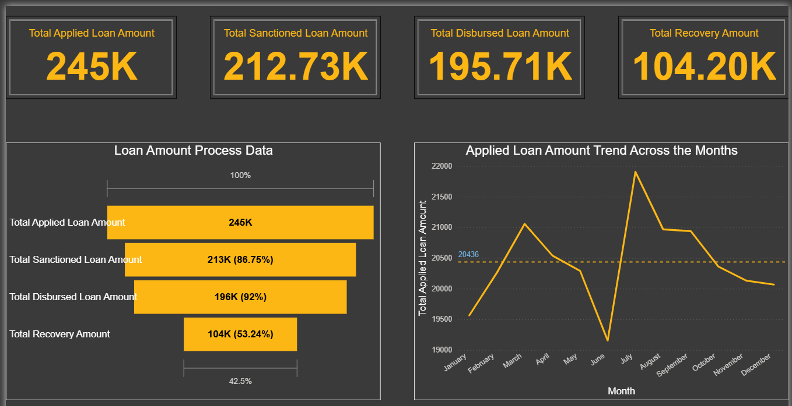
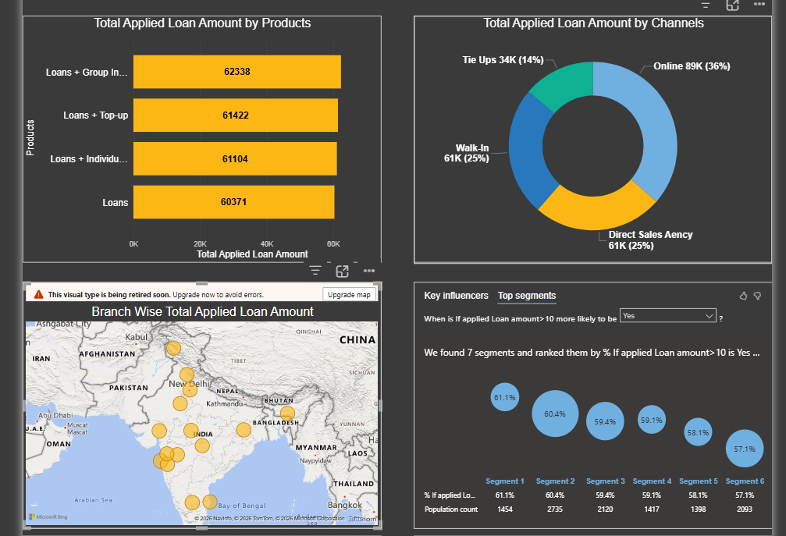

# 📊 Loan Analysis Dashboard (Power BI Project)

🚀 Actively seeking Data Analyst opportunities | Open to work

## 🔍 Overview

This project presents a comprehensive **Loan Analysis Dashboard** built using Power BI. It provides insights into loan application trends, sanction rates, disbursement performance, and recovery efficiency.

The dashboard helps stakeholders make **data-driven decisions** by analyzing customer behavior, product performance, and regional distribution.

---

## 🎯 Objectives

* Analyze total loan applications and trends
* Evaluate sanction and disbursement efficiency
* Identify high-performing loan products
* Track recovery rates
* Understand channel contribution (Online, Walk-in, Agency)

---

## 📌 Key Metrics

* Total Applied Loan Amount: **245K**
* Total Sanctioned Loan Amount: **212.73K**
* Total Disbursed Loan Amount: **195.71K**
* Total Recovery Amount: **104.20K**

---

## 📊 Dashboard Features

### 1. Loan Distribution by Products

* Group Loans contribute the highest share
* Top-up loans show strong performance

### 2. Channel Analysis

* Online channel dominates (36%)
* Walk-in and Direct Sales contribute equally (25%)

### 3. Regional Analysis

* Branch-wise loan distribution across India
* High concentration in metro and semi-urban regions

### 4. Monthly Trend Analysis

* Peak in August
* Drop observed in June
* Stable trend towards year-end

### 5. Loan Funnel Analysis

* 86.75% of applied loans are sanctioned
* 92% of sanctioned loans are disbursed
* Recovery rate is comparatively low (53%)

---

## 🧠 Key Insights

* Digital adoption (Online channel) is the strongest driver
* Loan recovery needs improvement
* Seasonal spikes indicate demand patterns
* Product bundling (Loans + Group/Top-up) performs better

---

## 🛠 Tools Used

* Power BI
* Excel / CSV dataset
* Data Modeling (DAX)

---

## 📂 Files Included

* `dashboard.pbix` → Power BI Dashboard
* `loan_data.csv` → Dataset
* `images/` → Dashboard screenshots
* `docs/` → Insights & documentation

---

## 📸 Dashboard Preview

---

## 🚀 How to Use

1. Download the `.pbix` file
2. Open in Power BI Desktop
3. Refresh data if needed

---

## 📬 Contact

If you found this useful or want to collaborate:

* LinkedIn: (Add your link)
* Email: (Add your email)

---

⭐ If you like this project, give it a star!
